# Real-Time IoT Device Data Streaming Platform

This project is a prototype of a distributed, high-throughput data streaming platform for IoT device data.  

The goal is not to build a production-ready system, but to explore how distributed architectures evolve as they scale. Each iteration introduces new features, realistic business logic, and simulated product requirements. As the system grows more complex, I’ll benchmark performance, document results, and use the findings to identify bottlenecks and experiment with optimizations.

Over time, additional services will be introduced and existing ones scaled horizontally, while resource usage per service will remain consistent through fixed limits in Docker Compose. The focus is on understanding how distributed systems behave under load, how design trade-offs emerge, and how architectures adapt across the lifecycle of a project.

### Timeline

| Date     | Architecture Diagram | Performance Results |
|----------|----------------------|---------------------|
| TBD      | [v0 Architecture](#v0-architecture-diagram) | [v0 Results](#v0-performance-results) · [JSON](/performance/v0_results.json) |

---

### Changelog

- **v0 (TBD)** — Initial version. Producer API → Kafka → Consumer API. No database. Simple, in-memory real-time metrics + anomaly detection.  
- **v1 (TBD)** — Database integration (Postgres) for persistence. Consumer API writes metrics + anomalies to DB with defined schema. REST API for querying historical data.
- **v2 (TBD)** — Visualization layer (Grafana). Enhanced anomaly detection. Alerting/notification system.
- **v3 (TBD)** — Scalable deployment. Multiple consumer groups + partitioning for high throughput.
- **v4 (TBD)** — Rewrite APIs in Go.

---

### Architecture Evolution

#### v0 Architecture Diagram

```mermaid
graph TB
    %% External layer
    IoT[🌡️ IoT Devices<br/>Simulated Load Generator] 
    
    %% API Gateway layer
    subgraph "Ingestion Layer"
        Producer[📥 Producer API<br/>FastAPI<br/>:8000<br/>POST /ingest]
    end
    
    %% Message Queue layer
    subgraph "Message Streaming"
        Kafka[📨 Apache Kafka<br/>Topic: iot-sensor-data<br/>:9092]
    end
    
    %% Processing layer
    subgraph "Processing Layer"
        Consumer[⚙️ Consumer API<br/>FastAPI<br/>:8001<br/>Background Thread]
        
        subgraph "In-Memory Storage"
            Cache[💾 Message Cache<br/>Last 100 messages]
            Stats[📊 Device Stats<br/>DEVICE_STATS dict<br/>• Running averages<br/>• Anomaly detection<br/>• Per-device metrics]
        end
    end
    
    %% Analytics layer
    subgraph "Analytics Endpoints"
        Analytics[📈 /analytics<br/>Recent messages]
        DeviceStats[📊 /device-stats<br/>Aggregated metrics]
        Anomalies[⚠️ /anomalies<br/>Flagged events]
    end
    
    %% Benchmarking layer
    subgraph "Performance Testing"
        Benchmark[🔬 Benchmark Service<br/>:8002<br/>• Load generation<br/>• Performance measurement<br/>• Results analysis]
    end
    
    %% Connections
    IoT --> Producer
    Producer --> Kafka
    Kafka --> Consumer
    Consumer --> Cache
    Consumer --> Stats
    Consumer --> Analytics
    Consumer --> DeviceStats  
    Consumer --> Anomalies
    
    Benchmark -.-> Producer
    Benchmark -.-> Consumer
    
    %% Docker container boundaries
    subgraph "Docker Containers"
        direction TB
        Producer
        Consumer
        Kafka
        Benchmark
    end
    
    %% Data flow annotations
    Producer -.->|"JSON validation<br/>Message enrichment<br/>UUID generation"| Kafka
    Kafka -.->|"Poll every 1s<br/>JSON parsing"| Consumer
    Consumer -.->|"Statistics calculation<br/>Anomaly detection<br/>In-memory storage"| Stats
    
    %% Performance characteristics
    classDef fastapi fill:#009688,stroke:#004d40,stroke-width:2px,color:#fff
    classDef kafka fill:#ff5722,stroke:#d84315,stroke-width:2px,color:#fff
    classDef storage fill:#2196f3,stroke:#1565c0,stroke-width:2px,color:#fff
    classDef benchmark fill:#9c27b0,stroke:#6a1b9a,stroke-width:2px,color:#fff
    classDef endpoint fill:#4caf50,stroke:#2e7d32,stroke-width:2px,color:#fff
    
    class Producer,Consumer fastapi
    class Kafka kafka
    class Cache,Stats storage
    class Benchmark benchmark
    class Analytics,DeviceStats,Anomalies endpoint
```

---

### Performance Results

#### v0 Performance Results
| Test Type | Date/Time | Target RPS | Actual RPS | P99 Latency (ms) | Error Rate | Duration (s) |
|-----------|-----------|------------|------------|------------------|------------|-------------|
| light_load | 2025-09-24 14:40 | 25 | 24.9 | 5.6 | 0.0% | 60.3 |
| standard_load | 2025-09-24 14:42 | 100 | 99.4 | 4.9 | 0.0% | 120.0 |
| high_load | 2025-09-24 14:45 | 250 | 247.6 | 4.2 | 0.0% | 60.0 |
| ceiling | 2025-09-24 14:47 | 50 | 49.7 | 4.4 | 0.0% | 45.2 |
| ceiling | 2025-09-24 14:48 | 100 | 99.5 | 4.5 | 0.0% | 45.2 |
| ceiling | 2025-09-24 14:49 | 150 | 149.2 | 4.3 | 0.0% | 45.2 |
| ceiling | 2025-09-24 14:50 | 200 | 199.0 | 4.4 | 0.0% | 45.0 |
| ceiling | 2025-09-24 14:51 | 250 | 248.0 | 4.2 | 0.0% | 45.0 |
| ceiling | 2025-09-24 14:53 | 300 | 294.9 | 4.0 | 0.0% | 45.0 |
| ceiling | 2025-09-24 14:54 | 350 | 325.2 | 4.0 | 0.0% | 45.0 |
| ceiling | 2025-09-24 14:55 | 400 | 345.6 | 3.9 | 0.0% | 45.0 |
| ceiling | 2025-09-24 14:56 | 450 | 367.8 | 3.9 | 0.0% | 45.0 |
| ceiling | 2025-09-24 14:57 | 500 | 364.8 | 3.9 | 0.0% | 45.0 |
